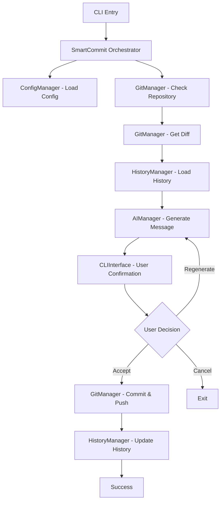

# SmartCommit Architecture

## Overview

SmartCommit has been refactored from a monolithic structure into a modular, maintainable architecture that follows separation of concerns principles.

## Project Structure

```
smartcommit/
├── src/                          # Source code directory
│   ├── cli.js                   # Main CLI entry point
│   ├── core/                    # Core business logic
│   │   └── SmartCommit.js       # Main orchestrator class
│   ├── utils/                   # Utility modules
│   │   ├── ConfigManager.js     # Configuration management
│   │   ├── GitManager.js        # Git operations
│   │   ├── AIManager.js         # AI/Gemini integration
│   │   ├── HistoryManager.js    # History and generation tracking
│   │   ├── CLIInterface.js      # User interaction
│   │   └── Logger.js            # Logging utility
│   └── constants/               # Application constants
│       └── index.js             # Constants and configuration
├── scripts/                     # Development and maintenance scripts
│   └── clean.js                 # Project cleanup script
├── data/                        # User data and configurations
│   ├── .gitkeep                # Ensures directory exists in git
│   ├── config.json             # User configuration (gitignored)
│   ├── generations/            # AI generation history
│   └── *.json                  # Repository-specific history files
├── package.json                # Project metadata and dependencies
├── README.md                   # User documentation
├── ARCHITECTURE.md             # This file
└── .gitignore                  # Git ignore patterns
```

## Module Responsibilities

### Core Layer

#### `SmartCommit.js`

-   **Purpose**: Main orchestrator that coordinates all operations
-   **Responsibilities**:
    -   Command line argument parsing
    -   Workflow orchestration
    -   Error handling and recovery
    -   Integration of all utility modules

### Utility Layer

#### `ConfigManager.js`

-   **Purpose**: Handles all configuration-related operations
-   **Responsibilities**:
    -   API key setup and validation
    -   Configuration file management
    -   Default settings management
    -   Configuration updates and migrations

#### `GitManager.js`

-   **Purpose**: Manages all Git-related operations
-   **Responsibilities**:
    -   Repository validation and initialization
    -   Git status and diff retrieval
    -   File content analysis
    -   Staging and commit operations
    -   Push operations with upstream handling

#### `AIManager.js`

-   **Purpose**: Handles AI/Gemini API interactions
-   **Responsibilities**:
    -   Gemini API communication
    -   Prompt engineering and formatting
    -   Response parsing and validation
    -   Retry logic with exponential backoff
    -   Conventional commit format enforcement

#### `HistoryManager.js`

-   **Purpose**: Manages commit history and generation tracking
-   **Responsibilities**:
    -   Repository-specific history storage
    -   Generation metadata tracking
    -   Statistics and analytics
    -   Data cleanup and maintenance

#### `CLIInterface.js`

-   **Purpose**: Handles all user interactions
-   **Responsibilities**:
    -   Interactive prompts and confirmations
    -   Input validation and formatting
    -   Status display and feedback
    -   User choice processing

#### `Logger.js`

-   **Purpose**: Centralized logging and messaging
-   **Responsibilities**:
    -   Consistent message formatting
    -   Log level management
    -   Error reporting
    -   Debug information

### Constants Layer

#### `constants/index.js`

-   **Purpose**: Centralized application constants
-   **Responsibilities**:
    -   Commit type definitions
    -   Model configurations
    -   File type mappings
    -   Prompt templates

## Data Flow



## Design Principles

### 1. Separation of Concerns

Each module has a single, well-defined responsibility and doesn't cross boundaries into other domains.

### 2. Dependency Injection

The main SmartCommit class instantiates and injects dependencies, making the system testable and modular.

### 3. Error Isolation

Errors are handled at appropriate levels, with graceful degradation and user-friendly messaging.

### 4. Configuration-Driven

Behavior is controlled through configuration rather than hard-coded values.

### 5. Extensibility

New features can be added by extending existing modules or adding new ones without major refactoring.

## Benefits of This Architecture

### For Development

-   **Modularity**: Easy to understand, test, and modify individual components
-   **Testability**: Each module can be unit tested in isolation
-   **Maintainability**: Clear separation makes debugging and updates straightforward
-   **Extensibility**: New features can be added without affecting existing code

### For Users

-   **Reliability**: Better error handling and recovery
-   **Performance**: Optimized operations and resource usage
-   **Consistency**: Unified user experience across all operations
-   **Transparency**: Clear logging and feedback

## Future Enhancements

This architecture supports future enhancements such as:

1. **Plugin System**: Easy to add new AI providers or commit formats
2. **Testing Framework**: Modular structure supports comprehensive testing
3. **Configuration UI**: Web or desktop interface for configuration management
4. **Multiple AI Providers**: Support for OpenAI, Claude, etc.
5. **Advanced Git Operations**: Branch management, merge assistance, etc.
6. **Team Features**: Shared configurations, team statistics, etc.

## Migration from Previous Version

The monolithic `index.js` (654 lines) has been broken down as follows:

-   **Core Logic**: Moved to `SmartCommit.js` (150 lines)
-   **Configuration**: Extracted to `ConfigManager.js` (100 lines)
-   **Git Operations**: Moved to `GitManager.js` (120 lines)
-   **AI Logic**: Extracted to `AIManager.js` (180 lines)
-   **History Management**: Moved to `HistoryManager.js` (140 lines)
-   **User Interface**: Extracted to `CLIInterface.js` (130 lines)
-   **Utilities**: Split into `Logger.js` and `constants/index.js`

This refactoring reduced complexity, improved maintainability, and made the codebase more professional and scalable.
